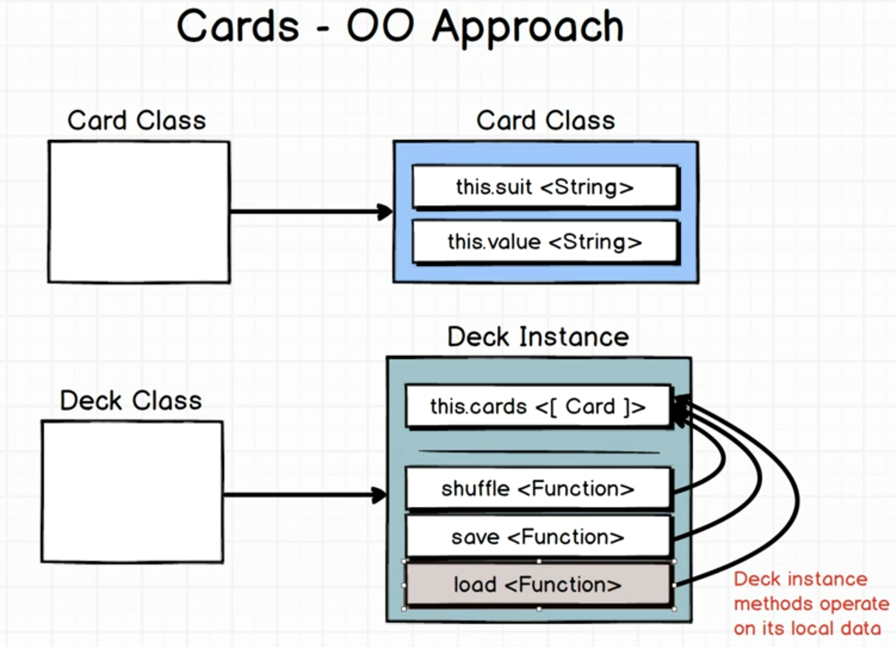
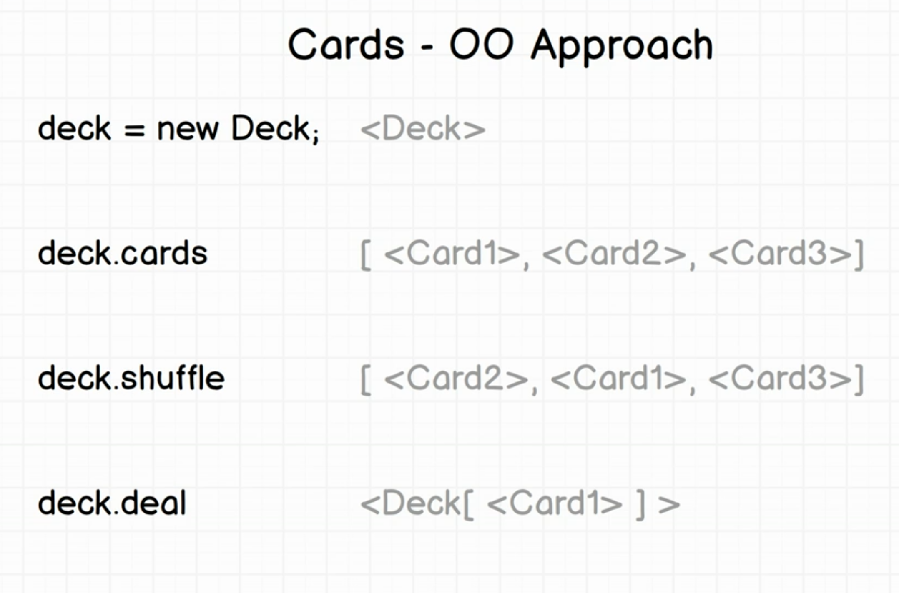
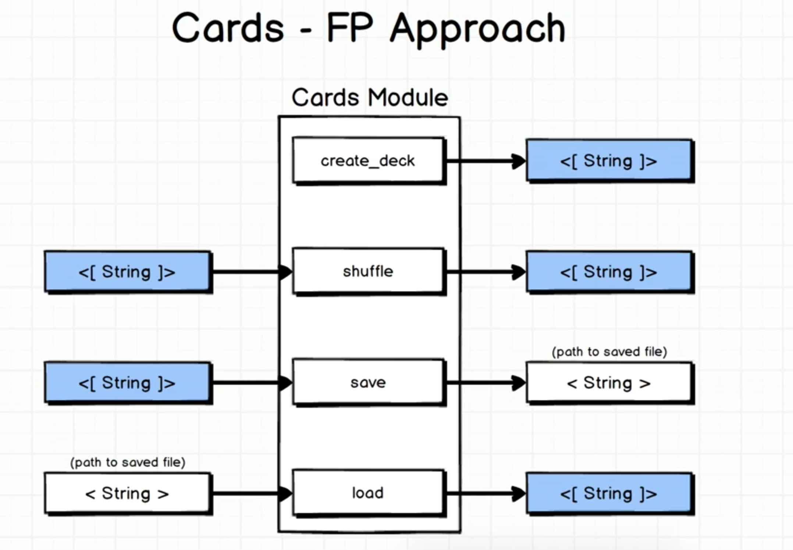
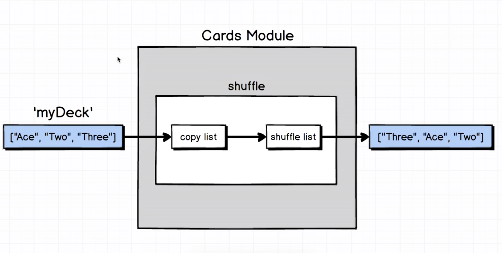
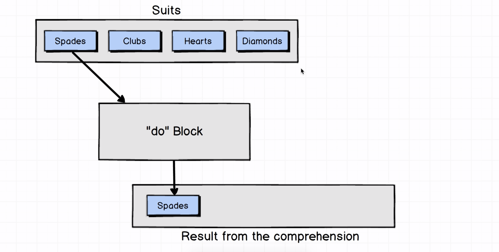
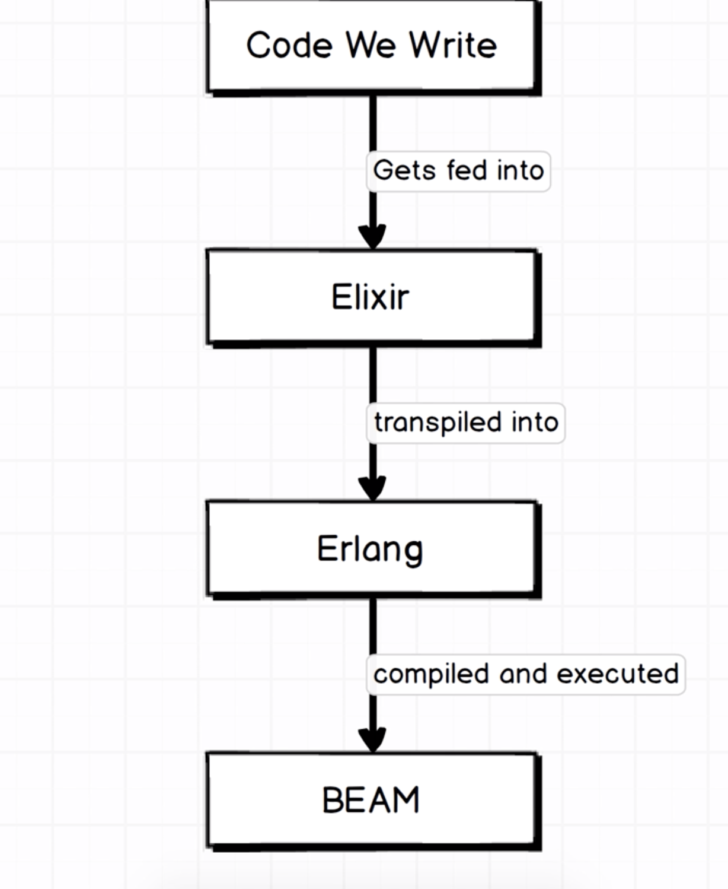

# Cards

**TODO: Add description**

## Problem Statement

## Concepts Explained

## Hello

## Installation

If [available in Hex](https://hex.pm/docs/publish), the package can be installed
by adding `cards` to your list of dependencies in `mix.exs`:

```elixir
def deps do
  [
    {:cards, "~> 0.1.0"}
  ]
end
```

Documentation can be generated with [ExDoc](https://github.com/elixir-lang/ex_doc)
and published on [HexDocs](https://hexdocs.pm). Once published, the docs can
be found at [https://hexdocs.pm/cards](https://hexdocs.pm/cards).

Elixir is a purely functional programming language

#### A module is a collection of different methods or functions

To run an elixir file : use command: iex -S mix (iex - interactive elixir shell)

You can run the command using Cards.hello

You can call function with/without parenthesis

Elixir has implicit return, which means Whenever a method or function runs whatever the last value inside that function is will automatically get returned. So I could have just as easily said Return Hi there or I could just left it off.

Lists:

We can define a list of elements by using the bracket notation for an array which is similar to Ruby javascript Java. Tons of other languages. So again nothing too bad here just yet we can create our array or our list as the term we are using a lot. After placing these square braces so directly in here we can put in a first couple of cards as just strings like is two and three. Notice I'm using double quotes in here as opposed to single quotes, They are are supported, but double quotes are convention,

Recompile: Elixir runtime cannot automatically check for and build changes in the code, it has to be done manually by the command "recompile"

Object Oriented vs Functional Programming:
Diff 1:



In OO approach, we have an instance of a class, with some methods, which operate on its local instance variable.
For Example:



Modules are collection of methods, and nothing else. There are no instance variables.

After creating your first method, you might encounter this error:

`** (UndefinedFunctionError) function Cards.shuffle/0 is undefined or private (cards 0.1.0) Cards.shuffle()`
Here `Cards.shuffle/0` means that shuffle method having `0` arguments, but we do not have such a method, we have something like `Cards.shuffle/1`, because we need to pass an argument `deck` to the shuffle method.

`arity` refers to number of arguments that need to be passed. eg: `shuffle/1` means that the `arity` is 1.

Elixir standard library includes lists, numbers, file-system, http library.

Immutability in Elixir: We cannot modify any data structure in Elixir. Every data structure is immutable. Whenever we modify a data structure, we create a new data structure and return.


Convention: Whenever, a function/method is supposed to return a true/false (boolean value), use a post-fix of `?` to indicate the same.

For eg: for a sample method `contains` which takes in arguments `deck, hand` & returns either `true/false`, this method can be defined as follows:
`def contains?(deck, hand) do //Enter body here end`
Notice, the ? does not do anything, except that it used as a convention.

### List: A collection of similiar records.

### List comprehension:



`for suit <- suits do suit end`
This can be read as,

> For every element in suits, return the element. And the entire returned array is a map.

> 💡 Elixir supports template literals `"#{value} of #{suit}"`

#### Nested Comprehension

Whenever a nested list comprehension method is called, it finally returns a list of list, so to convert it into a simple list, use List.flatten function.

Solution 2: A much efficient solution.
`for suit <- suits, value <- values do "#{value} of #{suit}" end`

#### Tuples: A collection of different types, but is indexed, which means the order carries some meaning

`{["elem1","elem2","elem3","elem4"] , ["elem4","elem5","elem6"]}`

`deck[0] does not work in elixir for lists or tuples, we cannot get an element at the 0th index in this manner.`

### Pattern Matching: Elixir's replacement for variable assignment which means

`{hand, deck} = {Hand, The Rest} #Here, Hand list is stored in hand variable, and The Rest list is stored in deck variable. In this way both of the values of the tuple can be extraced`

> Anytime you use equals, think pattern matching

### How does elixir work?



###### Erlang was used for telephony purposes
