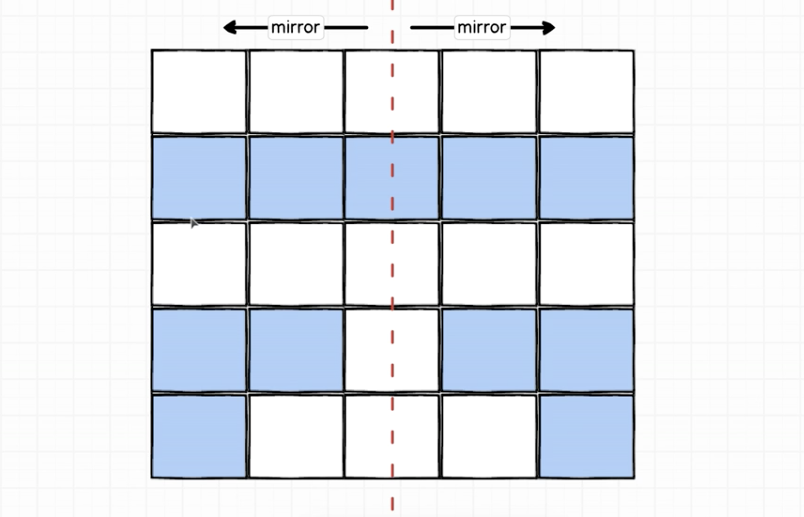
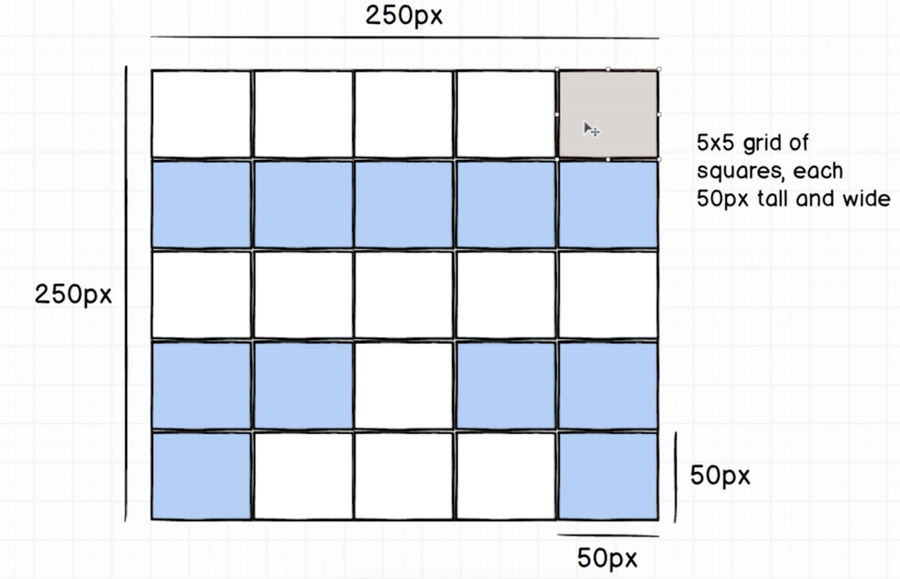
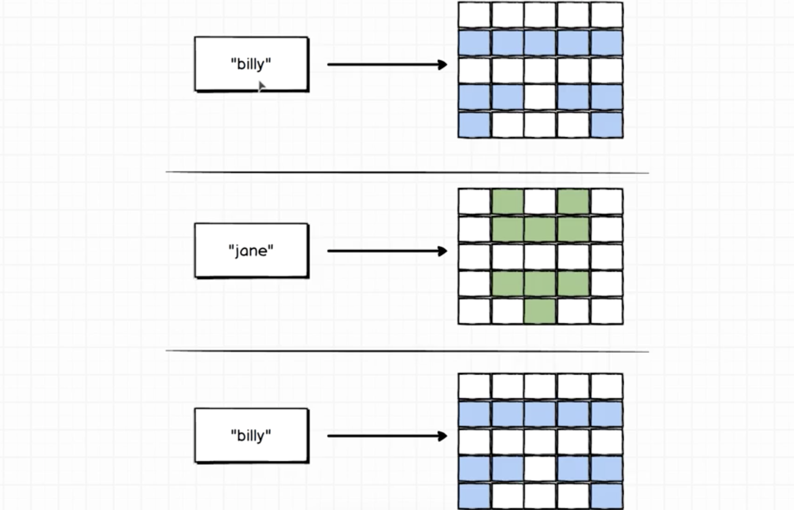

# Identicon

**TODO: Add description**

## Description of Project

We would be writing a program to randomly generate an identicon / gravatar, which can be seen on Github Profiles like this:

The important thing about this identicon is that it is always mirrored vertically, meaning, that the LHS = RHS.

We have to generate a 5x5 grid with squares 50px tall and 50px wide: (Total 250px X 250px)

Also, the identicon is based on the "name" that is provided and we need to have same identicon for the same name: Eg: if "billy" is entered twice, it should display the same identicon everytime
