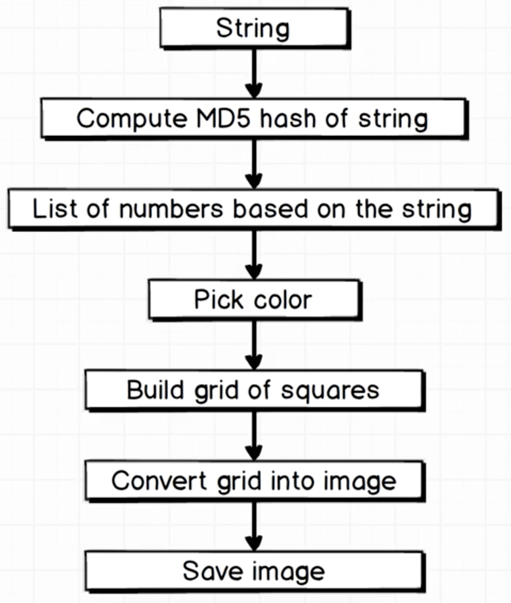

# Identicon

**TODO: Add description**

## Description of Project

We would be writing a program to randomly generate an identicon / gravatar, which can be seen on Github Profiles like this:


The important thing about this identicon is that it is always mirrored vertically, meaning, that the LHS = RHS.


We have to generate a 5x5 grid with squares 50px tall and 50px wide: (Total 250px X 250px)


Also, the identicon is based on the "name" that is provided and we need to have same identicon for the same name: Eg: if "billy" is entered twice, it should display the same identicon everytime


#### The Process


## Conversion of String to Image



## hashing

When we hash a string, we get a series of numbers corresponding to the string

## Create the Main Function

This function has a set of pipe functions which call all the functions of the processes shown in the above image

## Hashing

```bash
iex(1)> hash = :crypto.hash(:md5, "banana")
<<114, 179, 2, 191, 41, 122, 34, 138, 117, 115, 1, 35, 239, 239, 124, 65>>
iex(2)> :binary.bin_to_list(hash)
[114, 179, 2, 191, 41, 122, 34, 138, 117, 115, 1, 35, 239, 239, 124, 65]
```
