### What is Phoenix?

Phoenix's job is to behave as a web-server
It communicates with a database and can also communicate with HTML, JSON & Web Sockets
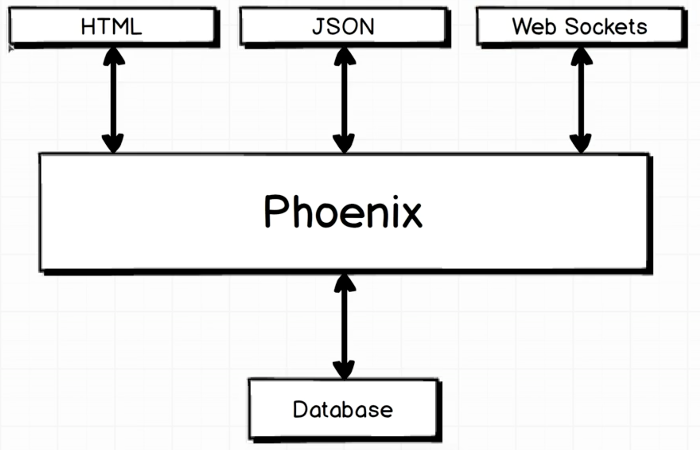

Database: Traditionally used PostgreSQL, but can use anything (MySQL, SQLite, MongoDb)

#### How phoenix handles incoming requests?

Look at our previous project in Elixir to create an identicon!
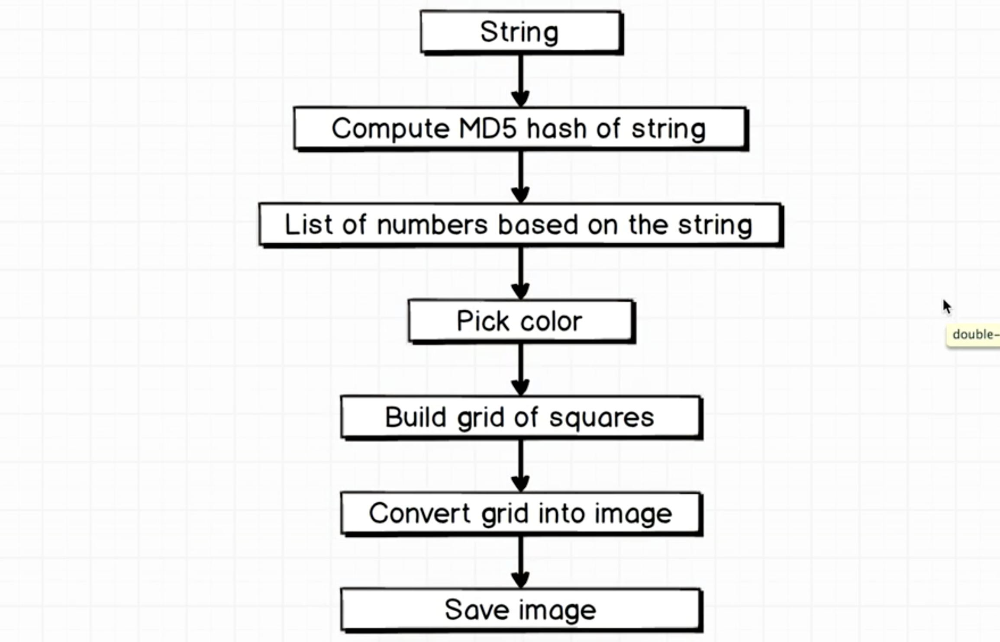

The exact same steps will be followed to handle an HTTP Request
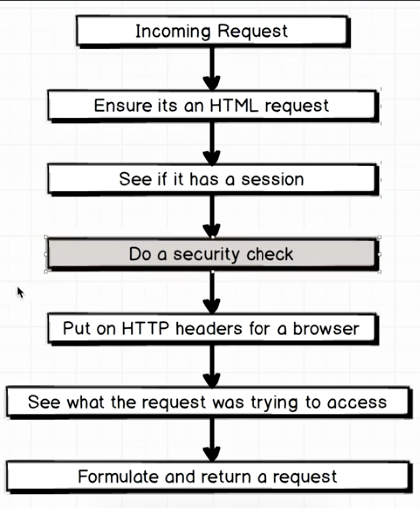

## Create a new project in Phoenix

``` elixir
> mix phx.new discuss
```

Here `mix` is a build tool, `phx.new` command creates a new phoenix project (Earlier, it was phoenix.new), `discuss` is the name of the project.

### The app that we are building

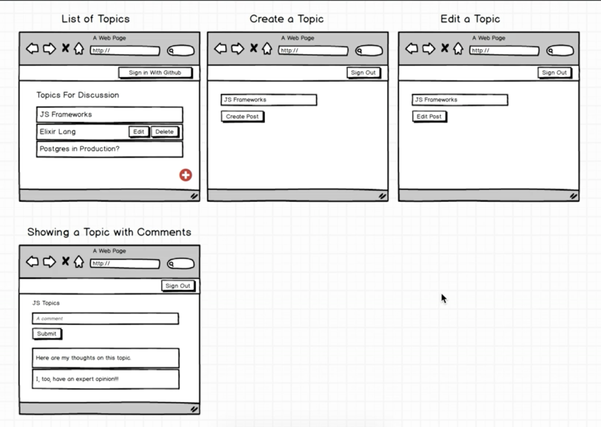

A Forum kind of a project! Where users sign-up to the forum with `Github` (using O-Auth), they can post anything that serves as a topic of discussion, They can create a topic, and other users can comment on it. (Imagine like a reddit clone)

#### First Steps:

The first command would be `mix ecto.create`

This command will create the PostGres database for out Project.

At first you may get an error message like this

``` bash
atharvakulkarni@Atharvas-MacBook-Pro discuss (master)]$ mix ecto.create
Compiling 14 files (.ex)
Generated discuss app

09:01:09.385 [error] GenServer #PID<0.375.0> terminating
** (DBConnection.ConnectionError) tcp connect (localhost:5432): connection refused - :econnrefused
    (db_connection 2.2.2) lib/db_connection/connection.ex:87: DBConnection.Connection.connect/2
    (connection 1.0.4) lib/connection.ex:622: Connection.enter_connect/5
    (stdlib 3.13) proc_lib.erl:226: :proc_lib.init_p_do_apply/3
Last message: nil
State: Postgrex.Protocol
** (Mix) The database for Discuss.Repo couldn't be created: killed
```

This is because the username and password does not seem to match for our PostGres Database.

#### How to solve the PostGres Connection Refused Error (Phoenix Project)

To solve this issue, go to the dev.exs file in `*your project name (discuss)*/config/**dev.exs**`
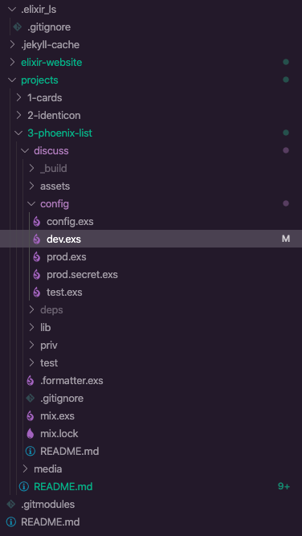

Here, most likely, your username value would show `postgres`. This is the default username provided by postgres and we don't want to use that.

``` bash
> whoami
atharvakulkarni
```

1. In your terminal, type the command `whoami`, you will receive your username, paste it in the `username` field in the `dev.exs` folder.
2. Run the `mix ecto.create`

``` bash
> mix ecto.create
Compiling 14 files (.ex)
Generated discuss app
The database for Discuss.Repo has been created
```

#### Starting the phoenix LiveServer

1. Execute in Terminal : `mix phx.server`
2. It starts the server at `localhost:4000`
3. You will be displayed with a nice welcome screen

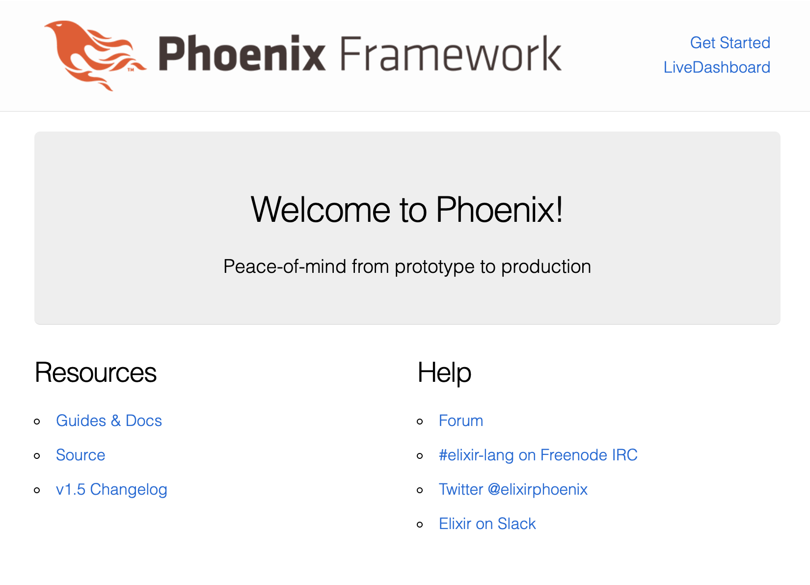


#### 💡 Whenever starting the liveServer, make sure you have PostGres running. I have installed PostGres as an application, so its easier for me that way

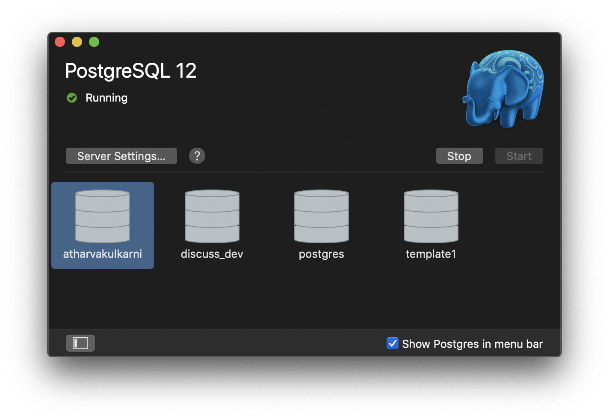

#### Server Side Templating vs SPA in Phoenix

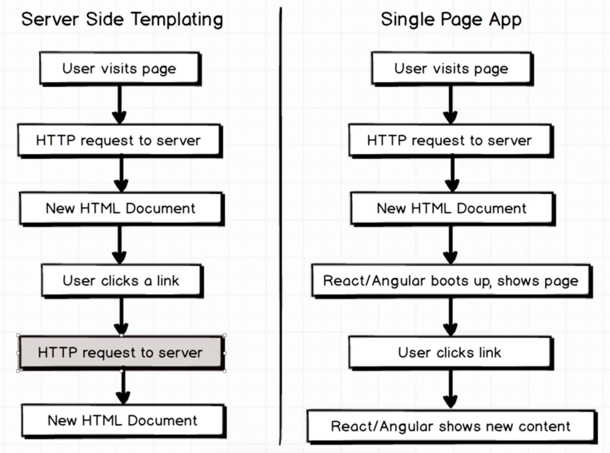

Phoenix supports both the types, initially we start with Server Side Templating, and later on, as we deep-dive into Phoenix, we can head over to SPA kind of an architecture.

The main difference between SSR and SPA is that, whenever the user performs any action, a fresh HTTP request is sent to the server, whereas in SPA, the client (User's Web browser) already loads the entire HTML Document from the server, so when a link is clicked, it does not send a fresh HTTP Request to the server.

#### Setting up Material Design in Phoenix

Head over to [Materialize CSS](https://materializecss.com/getting-started.html), and copy the CSS CDN. We won't be needing JS CDN in this project.

Head over to `projects/3-phoenix-list/discuss/lib/discuss_web/templates/layout` and in the `app.html.eex` page, paste the CDN link.

Run the project by the command [`mix phx.server`](#starting-the-phoenix-liveserver)

💡 Tip: Make sure you have PostGres SQL running on your machine, otherwise you may see a lot of errors in your terminal.

### MVC in Phoenix

To Understand the MVC (Model-View-Controller) Paradigm, let us consider an analogy:

You want to summarise the process of making muffins to someone else. There are essentially 3 components involved:

1. The batter itself which is the raw material required to produce muffins
2. A muffin tray, which puts the batter in a very distinctive shape and size.
3. A cook, who puts the batter in the muffin tray.

Similarly, while generating a web page like the following:

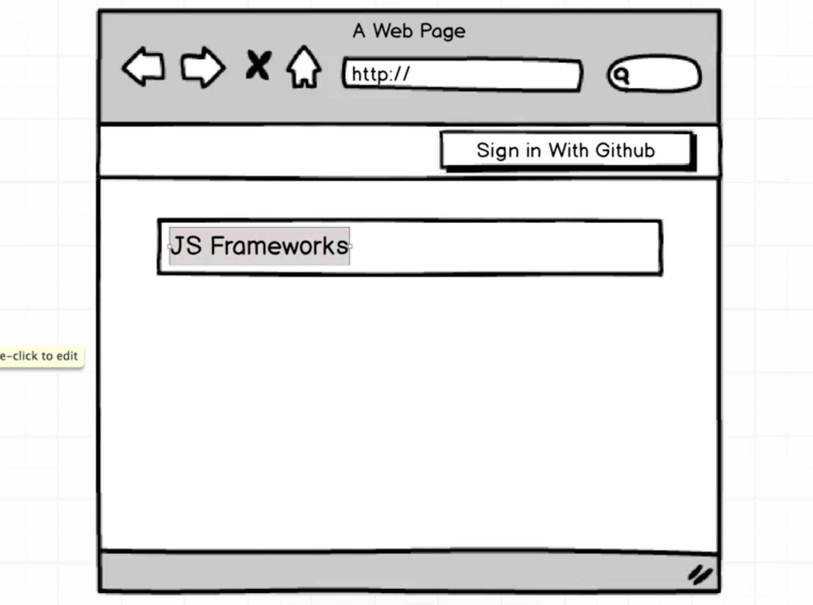

##### The following components are involved in the process:

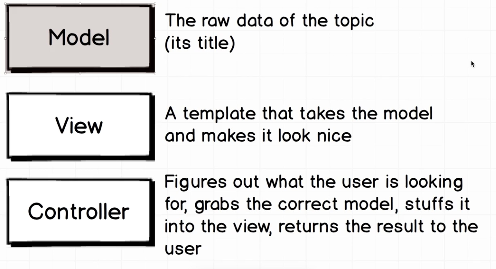

Similar to the previous analogy:

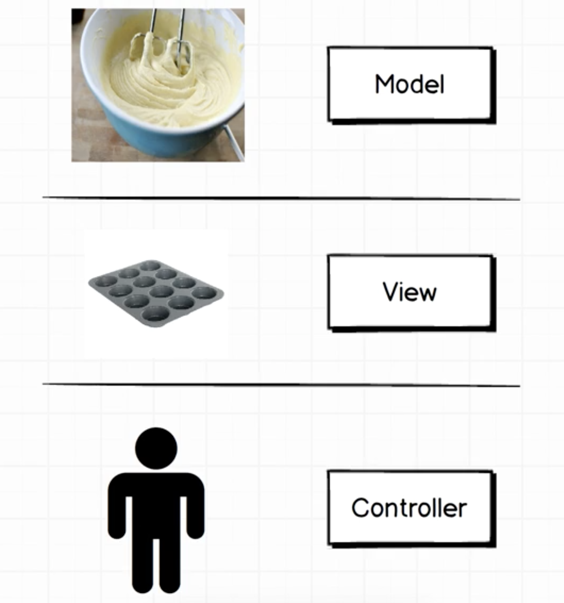

💡 The controller (Cook) looks out for a particular data required, for Example : "My Customer requires Blueberry Muffins, so I'm going to make Blueberry Muffins!", Similiarly the controller knows what kind of data the user wants on the UI, and hence takes that particular data from the Model.

🌟 MVC Architecture is not limited to Object Oriented Programming! It can also be applied to Functional Programming paradigm and pretty much any other programming paradigm.

> <b>☄️ MVC Paradigm &lt;=&gt; MVC Architecture &lt;=&gt; MVC Pattern (People use these terms interchangeably but they essentially mean the same `most of the time`</b>)

#### What happens when the User makes a request (HTTP, JSON, image, media) to the application

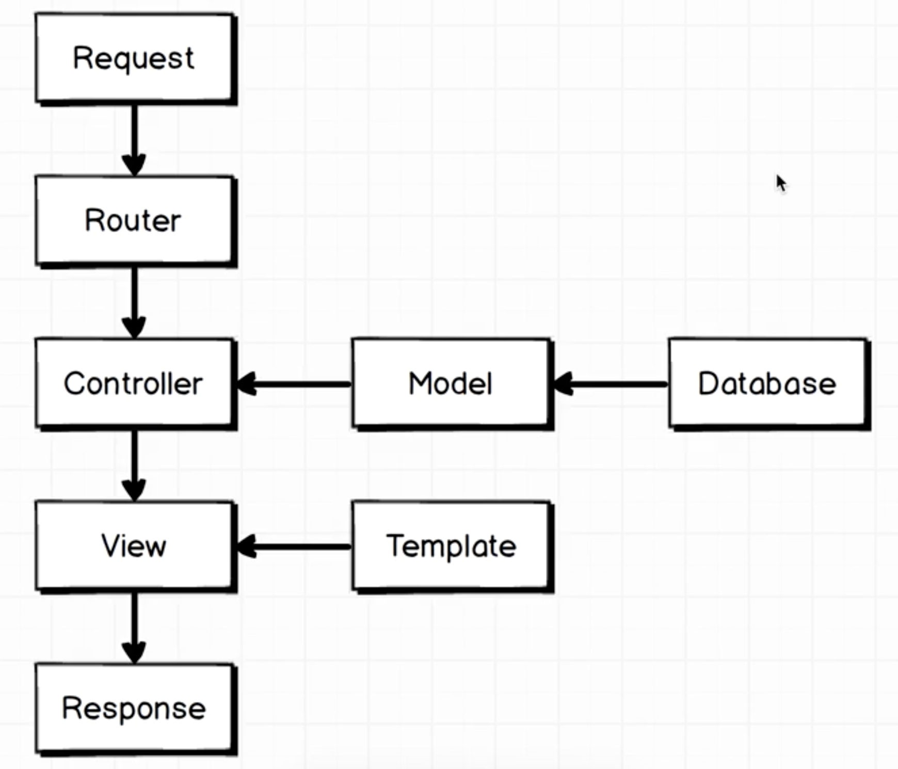

#### Controller & Router

In the router.ex

``` elixir
scope "/", DiscussWeb do
    pipe_through :browser

    get "/", PageController, :index
  end
```

The above code just means

> whenever we make a request for the index page (Eg: localhost:4000 <=> localhost:4000/ )
> activate the controller called as `PageController`

Now, `PageController` is a module defined in the `projects/3-phoenix-list/discuss/lib/discuss_web/controllers/page_controller.ex`

### What happens in the `page_controller.ex` 

```elixir
def index(conn, _params) do
    render(conn, "index.html")
  end

```

The `render` function renders the `index.html` file along with data in the `conn` object.

The name `PageController` is a default controller to work with when we first generate our project. Our actual project would consist of other controllers and this one would be deleted.


### Views vs Templates in Phoenix

In the `projects/3-phoenix-list/discuss/lib/discuss_web/views/page_view.ex` page_view.ex file, we have a module defined as `PageView`. 

What does Phoenix do behind the scenes?

1. It takes the module-name `PageView` and searches for the string `Page` (the prefix of PageView), and searches for a "page" folder in the "templates" folder. 
2. If found, it executes all the files present in the "page" folder.

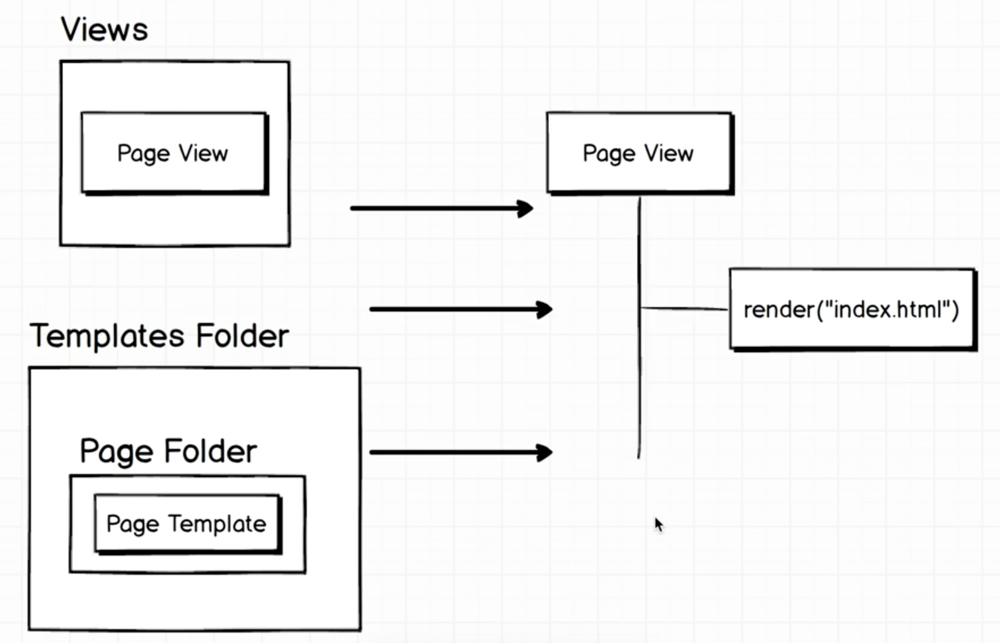

Executing the code:


```bash
[atharvakulkarni@Atharvas-MacBook-Pro discuss (master ✗)]$ iex -S mix phx.server
Erlang/OTP 23 [erts-11.0] [source] [64-bit] [smp:4:4] [ds:4:4:10] [async-threads:1] [hipe] [dtrace]

[info] Running DiscussWeb.Endpoint with cowboy 2.8.0 at 0.0.0.0:4000 (http)
[info] Access DiscussWeb.Endpoint at http://localhost:4000
Interactive Elixir (1.10.3) - press Ctrl+C to exit (type h() ENTER for help)
iex(1)> 
nil

iex(3)> DiscussWeb.PageView
DiscussWeb.PageView
iex(4)> DiscussWeb.PageView.render("index.html")
{:safe,
 ["<section class=\"phx-hero\">\n  <h1>", "Welcome to Phoenix!",
  "</h1>\n  <p>Peace-of-mind from prototype to production</p>\n</section>\n\n<section class=\"row\">\n  <article class=\"column\">\n    <h2>Resources</h2>\n    <ul>\n      <li>\n        <a href=\"https://hexdocs.pm/phoenix/overview.html\">Guides &amp; Docs</a>\n      </li>\n      <li>\n        <a href=\"https://github.com/phoenixframework/phoenix\">Source</a>\n      </li>\n      <li>\n        <a\n          href=\"https://github.com/phoenixframework/phoenix/blob/v1.5/CHANGELOG.md\"\n          >v1.5 Changelog</a\n        >\n      </li>\n      <li>\n        <a href=\"https://google.com\">Google</a>\n      </li>\n    </ul>\n  </article>\n  <article class=\"column\">\n    <h2>Help</h2>\n    <ul>\n      <li>\n        <a href=\"https://elixirforum.com/c/phoenix-forum\">Forum</a>\n      </li>\n      <li>\n        <a href=\"https://webchat.freenode.net/?channels=elixir-lang\"\n          >#elixir-lang on Freenode IRC</a\n        >\n      </li>\n      <li>\n        <a href=\"https://twitter.com/elixirphoenix\">Twitter @elixirphoenix</a>\n      </li>\n      <li>\n        <a href=\"https://elixir-slackin.herokuapp.com/\">Elixir on Slack</a>\n      </li>\n    </ul>\n  </article>\n</section>\n"]}

```

Here, phoenix directly renders the Index.html page, by executing the "page" folder files directly from PageView module.

💡 The names of our Views, Templates, Models & Controllers are closely linked. So naming conventions are important in elixir & phoenix.

### The Model Layer in Phoenix

💡 Phoenix does not care which database you use, but PostGres functionality comes out-of-the-box for the Phoenix Framework. So we have used PostGres Db.


Phoenix knows that there is a database, but does not know what data is in the database.

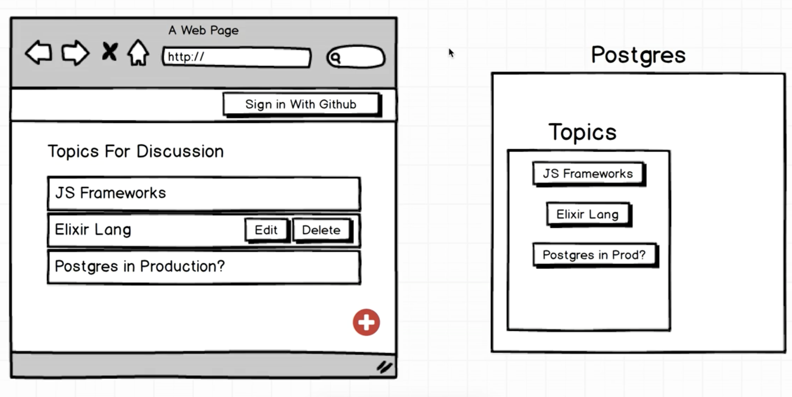

#### We will create Topic Models
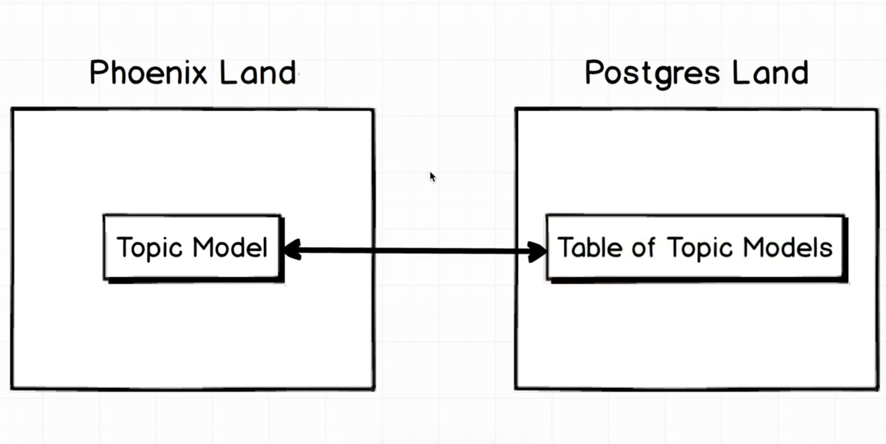

#### Working with Lists

1. Initially we have an empty database.
2. We tell PostGres to setup an empty table called "Topics"
3. This is called Db Migration, where you provide the Db with some instructions to create tables in the Db.

### Creating Migration Files

```bash
[atharvakulkarni@Atharvas-MacBook-Pro discuss (master ✗)]$ mix ecto.gen.migration add_topics
* creating priv/repo/migrations/20200610032037_add_topics.exs

```
You can see the the file is created in :
`projects/3-phoenix-list/discuss/priv/repo/migrations/20200610032037_add_topics.exs`

#### Creating a table

in the ...add_topics.exs file above, append the following code:

```elixir
def change do
    create table(:topics) do
      add :title, :string
    end
  end
```

This code:
1. Creates a table with the name "topics"
2. Adds 1 column: "title" with the type "string"

After you save the code, run this command in terminal:

```bash
[atharvakulkarni@Atharvas-MacBook-Pro discuss (master ✗)]$ mix ecto.migrate

08:56:13.008 [info]  == Running 20200610032037 Discuss.Repo.Migrations.AddTopics.change/0 forward

08:56:13.011 [info]  create table topics

08:56:13.148 [info]  == Migrated 20200610032037 in 0.1s
```

You will be able to see that the migration happened almost effortlessly. This means that, now Phoenix knows, that there is a table called "topics" with a column called "title" in our Db.


#### Looking at out Db Visually

Install a GUI Tool for PostGres: Postico (Download for Mac from [here](https://eggerapps.at/postico/))

This tool will help us visualise the databases and tables we will create further.

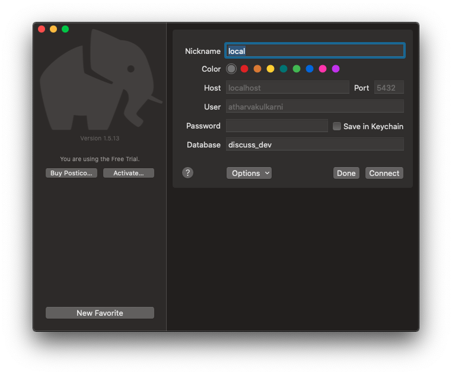

Postico Default Settings:
1. A favourite is created. Add a name "local"
2. The Host and Port is default.
3. The Username is your username
4. The Database is "discuss_dev" which we have just created.
5. Click on "Connect"

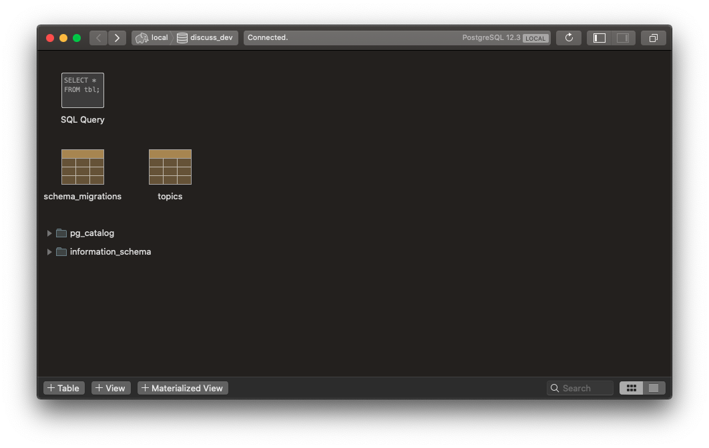

You see that a table with the name "Topics" has been created. If you go to the table, you will see a blank table with 2 columns:
1. id
2. title

This means that our Db migration was successful. And whenever we will add any data to this table, thro' Phoenix, the data will be shown in the GUI.


## Legend
#### <=> : Which is the same as
#### 💡: Tip
#### ⭐️ : Important Point to Remember