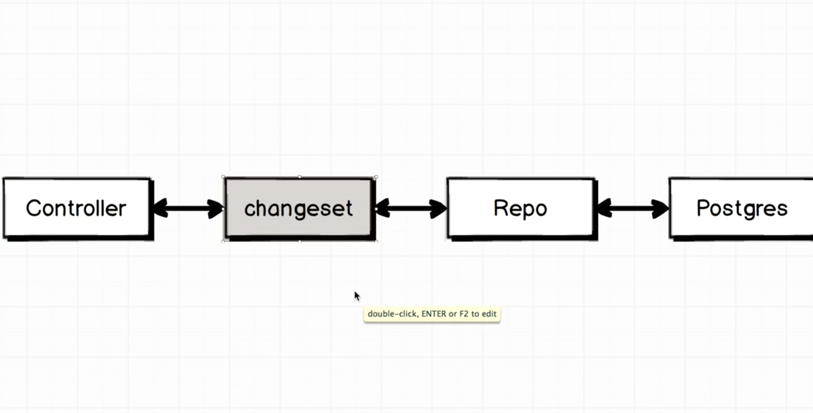

## Working with Postgres

###### What happens when a new topic is created?

The open source Project Phoenix depends heavily upon the open source project Ecto.Ecto gets already installed when you first install our Phoenix project so there is no need to reinstall Ecto.

